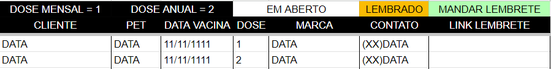

# Monitor de Vacinação de Clientes de Petshop/Veterinária

Este código tem como objetivo ajudar a monitorar a vacinação dos clientes de um petshop ou clínica veterinária. É um sistema singular, uma mescla de trabalho manual com um automatizado.

## Preparação

- Inicie um projeto no Google Cloud API, usando a API do Google Sheets.
- Configure a tela de proteção OAuth.
- Crie uma planilha no Google Sheets com as seguintes colunas, conforme exemplo:

- Importante, são 2 linhas de cabeçalho. Optei por congelar mas não é obrigatório.

**Formatos**

- Contato: dddxxxxxxxxx (Número completo e junto)
- Data Vacina: dd/mm/aaaa
- Dose: 1 (Renovação mensal) / 2 (Renovação anual)

## No Código

- Defina as variáveis no arquivo .env.
- Insira na pasta do código o arquivo "credentials.json" que você obtém na API do Google.

## Modo de Uso

- Preencha a planilha conforme o cliente vacina seus pets, atentando-se à coluna "Dose", como citado acima, pois irá definir o período para lembrete.
- Execute o código pelo menos uma vez por dia (Pode ser configurado o Task Manager). Ele fará uma checagem nas datas e definirá um lembrete pelo menos 1 semana antes da data de renovação.
- O lembrete será inserido como forma de link para o whatsapp já com a mensagem pronta para o cliente e a coloração indicativa para enviar lembrete.

Este código foi desenvolvido para uso interno em um petshop onde trabalho atualmente. Identifiquei esta necessidade, e como a empresa já tem um software terceiro como sistema principal, não busquei tentar integração, pois demandaria muito tempo e talvez nem seria possível. Portanto, não há controle de vendas nem nada muito automatizado, pois não há controle nem garantia de se o cliente realmente foi fazer a nova dose ou se ela expirou, sendo então necessárias mudanças nas doses do pet.

Se você deseja utilizar este código para uso pessoal, caso trabalhe na área, ou para estudos e modificações, estou à disposição.

## Redes

GitHub: [https://github.com/FelipeMBatista](https://github.com/FelipeMBatista)

LinkedIn: [https://www.linkedin.com/in/felipembatista/](https://www.linkedin.com/in/felipembatista/)

Instagram: [https://www.instagram.com/felipemb___/](https://www.instagram.com/felipemb___/)
